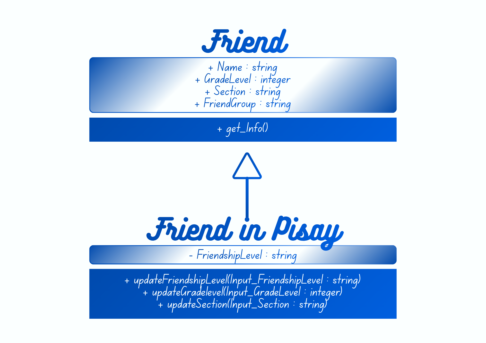
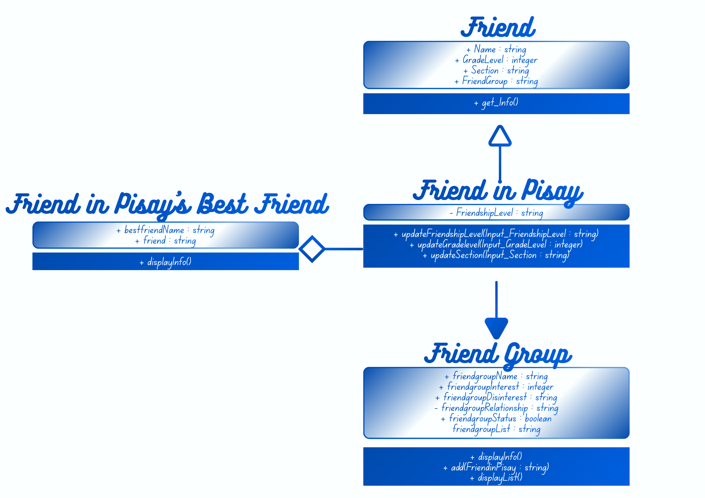
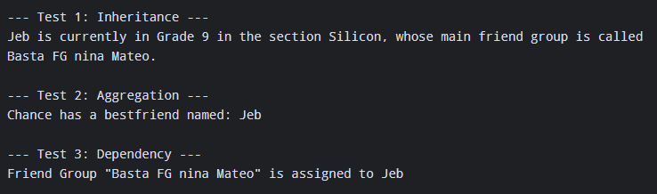
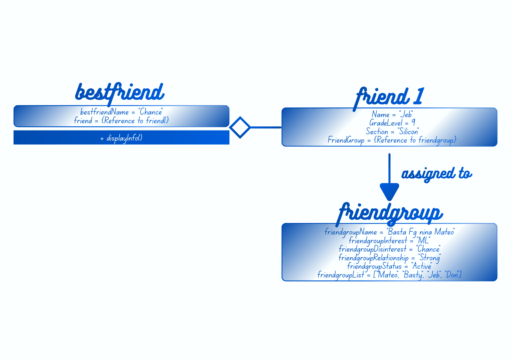

# Advanced Class Relationships
## Previous Activities
[classAttrib](classAttributesMethods.md)
[classRel](classRelationships.md)
## Existing System Description:
1. What classes currently exist in your system?
Class FriendinPisay and FriendGroup.

2. What problem or limitation exists in your current design?
**Unable to access the information of each friend in pisay through the class Group Friends** - The user is only able to access the information of each friend by looking or using the individual class Friend in Pisay. Thus, the names of each friend will appear in the class Group Friends, but each of their information will not be publicly shown.

## Inheritance Relationship
Parent: Friend

Child: FriendinPisay

Explanation: The parent class Friend contains the information, while the child class FriendinPisay inherits these feature and determines the FriendshipLevel of the Friend to the user. Also, the child class has methods like updating the friendship level, updating the grade level, and updating the section.

## Inheritance UML

## Composition/Aggregation
Relationship: Aggregation

Explanation: The class FriendinPisay_BestFriend cannot meaningfully exist without the class Friend in Pisay; however, class FriendinPisay can exist independently, possibly having their Best Friend assigned to them or not if they don't have any, ultimately making the class FriendinPisay_BestFriend HAS-A weak relationship with class FriendinPisay.
## Advanced UML Diagram

## Python Implementation
[Source Code](advancedRelationships.py)
## Test Run

## Object Diagram

## Reflection

1.) A FriendinPisay is-a specific type of Friend. It inherits all the information of a friend. However, it extends them with specialized traits unique to being a student at Pisay and its relationship with the user (such as friendship level).

2.) The child class reuses the information-holding attributes from the Friend class. Because of this, FriendinPisay is to focus only on defining its unique methods. For example, updating the friendship level, updating the grade level, and updating the section.

3.) They have independent lifecycles. A FriendinPisay can exist perfectly fine on its own without having a designated best friend. And, if the relationship ends or changes, both individual object instances continue to exist independently in the system.

4.) Implements strict structural hierarchies. The inheritance relationship establishes a specialized is-a lineage. The aggregation relationship in the other hand, organizes objects into a clear whole-to-part (HAS-A) hierarchy with weak ownership.

5.) The design isolates shared data structures and logic into a single source of truth within the parent Friend class. By leveraging inheritance, you eliminate the need to copy-paste core friend attributes into specialized subclasses. Because of this, it ensures that any future updates to generic friend behavior only need to be modified in one single place.
