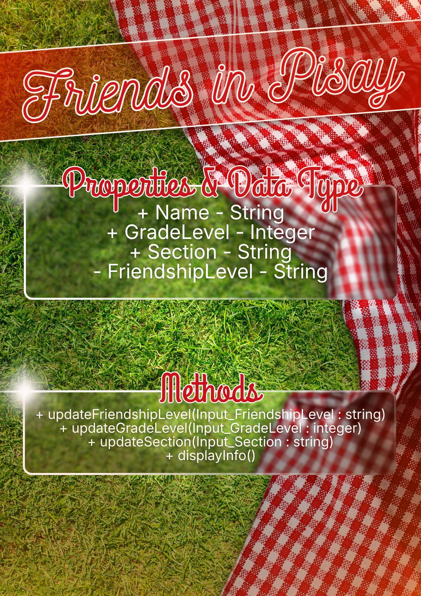
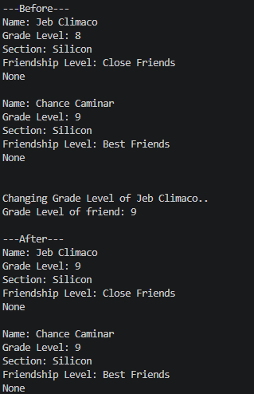
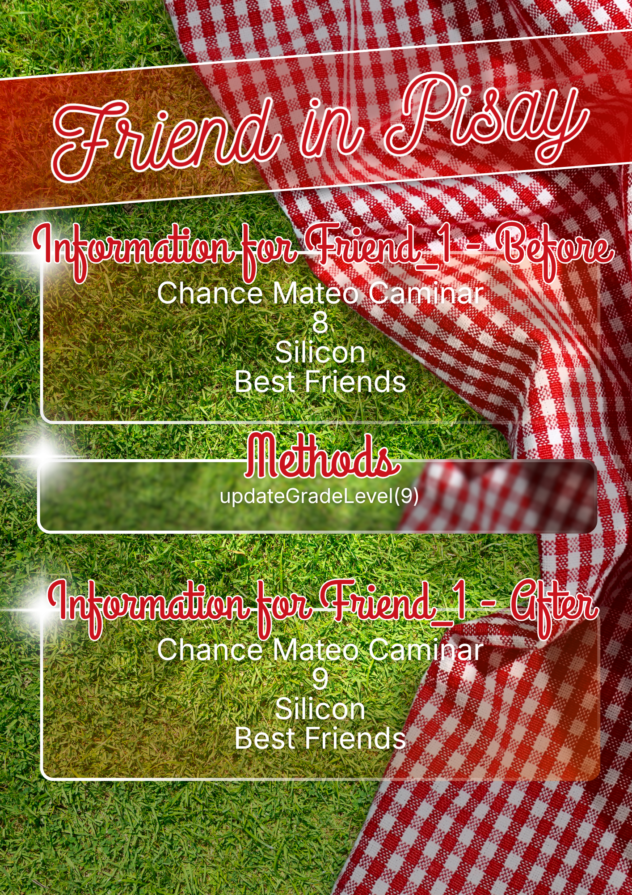

# Class Attributes and Methods
## Previous Design
Link to my previous activity:
[classObjectUML.md](classObjectUML.md)
## Design Revision
Describe any changes made to your original class.
## Visibility Decisions
| Attribute | Data Type | Visibility | Reason |
|---|---|---|---|
| Name | Integer | Public | Public so that anyone can see my friend's name. |
| GradeLevel | Integer | Public | Public so that anyone can see my friend's grade level. |
| Section | String | Public | Public so that anyone can see my friend's section. |
| FriendshipLevel | String | Private | Private so that I am the only one who can see my relationship with my friend.. |
## Updated UML Class Diagram

## Python Implementation

[View Python Source](classImplementation.py)
## Test Run

## Object Diagram

## Analysis
### Why did you make your chosen attribute private?
Friendship levels should only be visible to the user, not to the public. Relationship status should only be known by the two people involved, helping protect personal privacy and reduces outside pressure. If other parts of the program changed it directly, it would immediately fail to provide an honest classification that specifically tells the user their relationship level.
### Which method changes the state of your object?
First, method updateFriendshipLevel(Input_FriendshipLevel) since if it was to be used, it would update the friendship level of the friend. Second, method updateGradeLevel(Input_GradeLevel) since if it was to be used, it would also update the grade level of the friend, currently. Lastly, method updateSection(Input_Section) since if it was to be used, it would also update the section of the friend, currently.
### How did your two objects demonstrate that instances are independent?
It demonstrates that instances are independent by showing that if the attribute or property of one object was to be changed, it would not directly affect the other object. For example, when I chose to change object1's grade level from 8 to 9, it did not affect the grade level of the other object, but instead, it only updated the grade level of the selected object. This example proves my hypothesis that when an object's attribute was to be changed, it would not directly change the attribute of another object.
### What is the difference between your class diagram and your object diagram?
My class diagram represents the properties and methods that will be used as the basis for the making of the object diagram. The object diagram represents an example of using the class diagram. In conclusion, a class diagram is the architectural blueprint of a house, whereas an object diagram is a photograph of a specific house built from that blueprint.
