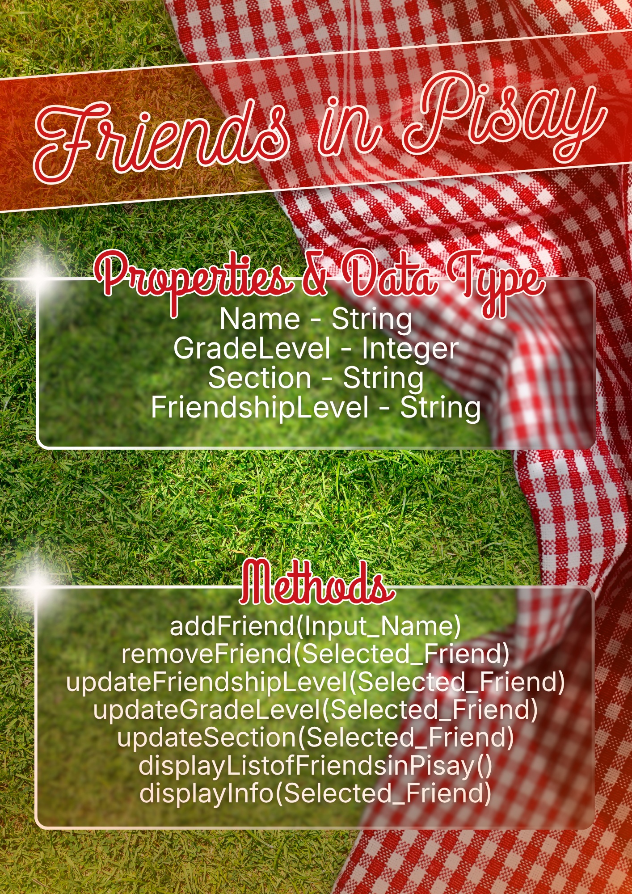

# SG4 - Understanding Classes and Objects
## Friends in Pisay
## A class that represents the user's friends in Pisay with information about their full name, grade level, section, and friendship level.
## Properties
| Property | Data Type | Description |
|---|---|---|
| Name | string | Name of friend in Pisay. |
| GradeLevel | integer | Grade level of friend currently. |
| Section | string | Section of friend currently. |
| FriendshipLevel | string | Friendship Level of friend currently (More than BFF, BFF, Close Friend, Friend). |
## Methods
| Method | Description |
|---|---|
| addFriend(Input_Name) | Adds a person as a friend, adding him or her in the list of friends in pisay. |
| removeFriend(Selected_Friend) | Removes a person as a friend, removing him or her in the list. |
| updateFriendshipLevel(Selected_Friend) | Updates a selected friend's friendship level to either ***More than BFF***, ***BFF***, ***Close Friend***, or ***Friend***. |
| updateGradeLevel(Selected_Friend) | Updates a selected friend's grade level to his or her grade level currently. |
| updateSection(Selected_Friend) | Updates a selected friend's section to his or her section currently. |
| displayListofFriendsinPisay() | Displays the list of friends in Pisay. |
| displayInfo(Selected_Friend) | Displays the information of the selected friend. |
## Class Diagram

## Design Explanation
### Why did you choose this class?
I chose this class because I personally want to keep track of all of my friends, monitoring whether I still talk to him or her, whether our friendship level is still able to keep its title, or if they have been promoted a grade level.
### Which property is the most important? Why?
Name; without the name, the user will not be able to identify who the information is referring to, completely destroying the whole purpose of the class.
### Which method is the most useful? Why?
addFriend(Input_Name); because it is the so-called "foundation" of the entire class; without it, there wouldn't be friends in the list to begin with, destroying the whole purpose of the class.
