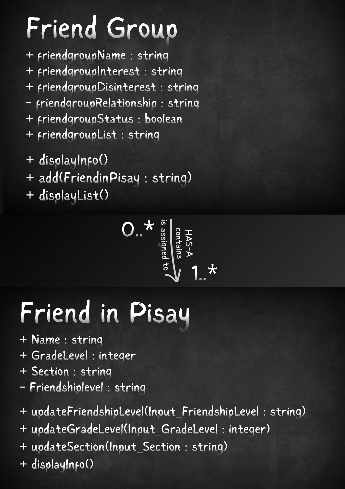
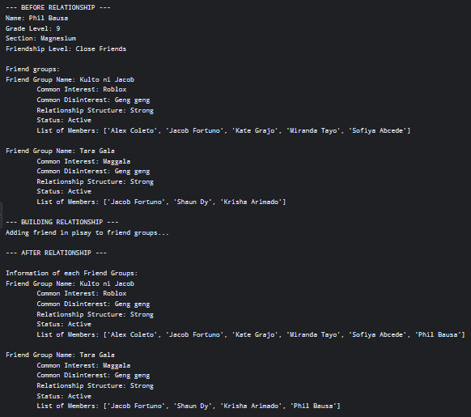

# Class Relationships: Association and Multiplicity
## Previous Work
[Part I - Classes and Objects](classObjectUML.md)
[Part II - Class Attributes and Methods](classAttributesMethod.md)

## Existing Class
Class: Friend in Pisay

Description: A class that represents the user's friend in Pisay with information about his or her full name, grade level, section, and friendship level.

## New Related Class
Class: Friend Group

Description: A class that represent's the user's known unique friend groups (also displaying its members) with information about their respective common interests, disinterests, relationship structure, and founders.

## Association
Relationship: Friend group HAS-A / contains / is assigned to Friend in Pisay

Explanation: The class, Friend group, contains the user's Friend in Pisay, but is assigned to their respective unique friend groups.

## Multiplicity
Multiplicity: Friend Group 0..* ───────── 1..* Friend in Pisay

Explanation: A friend group (if the friend doesn't have a friend group, then it will display "N/A") can be assigned to or contain the user's friend/s that are in Pisay.

## UML Class Relationship Diagram

## Python Implementation
[View Python Source](classRelationship.py)

## Test Run

## Object Relationship Diagram

## Analysis

### What is the association between your two classes?
The association is between classes "Friend Group" and "Friend in Pisay", where the user's friend in Pisay can be added to a Friend Group. The class friend group contains information that can be viewed by the user. And inside that friend group, anyone can alo view the information of each person.

### What multiplicity did you choose and why?
I chose 0..* : 1..* multiplicity. 0..* for Friend Group, so that it can be assigned or not to a friend. 1..* for Friend in Pisay, so that one or many friends can contain in a friend group.
### How did you implement the relationship in Python?
I implemented the relationship in Python by using the list of members list inside class Friend Group. The add(friend) method adds a friend in the list of members of a class Friend Group. This allows students to add their friend in a friend group class, to further organize their lists.
### Why did you store an object reference instead of copying its data?
I stored an object so that anyone can view the information of each friend groups and friends in Pisay. If a user decided to view a friend group's information, he or she can do it easily without any long process of copying the data. This improves the data accuracy of the program.
### If your relationship uses many, why is a list appropriate?
A relationship list is appropriate because it helps track and connect friend groups to different friend groups, or vice versa. The friendgroupList contains different friends with information, not just their names. Allowing anyone to view each friend group's and friend's infomation.
